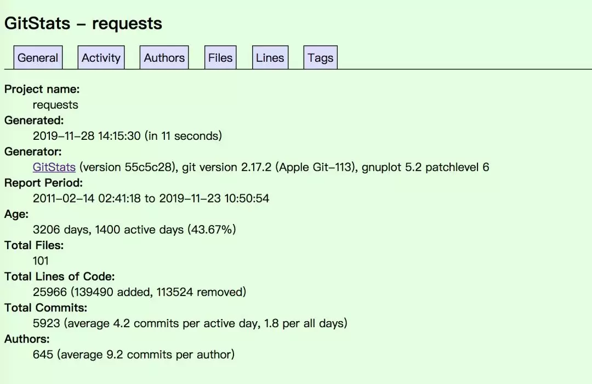
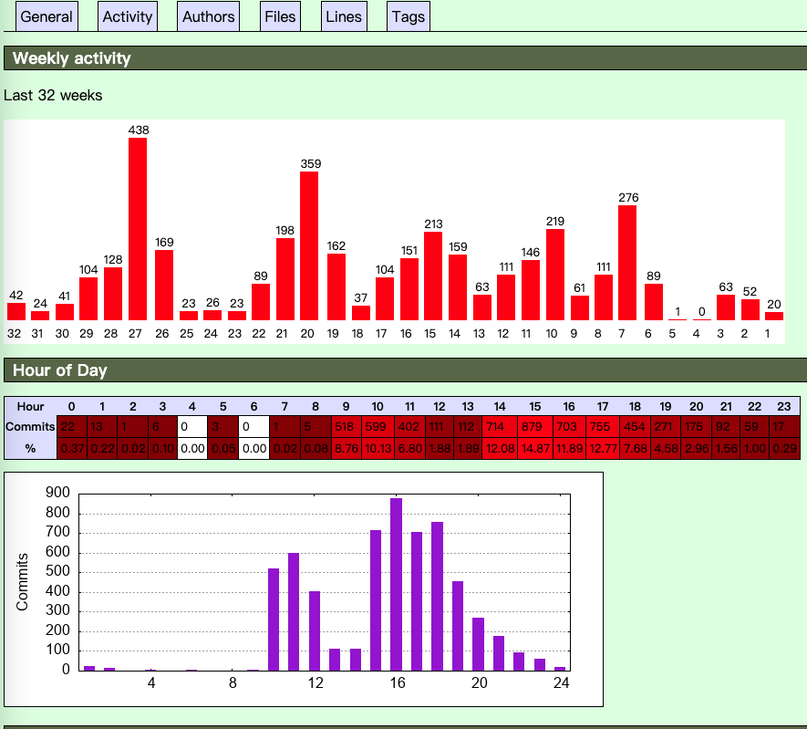
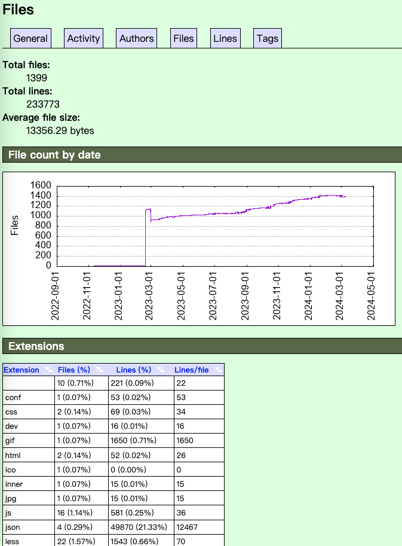

> Fork 至 hanzhichao/gitstats

官网介绍：http://gitstats.sourceforge.net/

## 更改

修改并适配了 Python3

1. 修改 print -> print()
2. 修改 map() -> list(map())
3. 修改 Pipline output -> output.decode()
4. 添加了部分中文注释

## 安装

- Ubuntu

```bash
apt-get install gitstats
```

- CentOS:

```bash
yum install gitstats
```

- Mac

```bash
brew install gnuplot
```

## 使用方式

### 1. 克隆 gitstats 源码库

打开 gitbash 或者其他 git 客户端，输入如下命令：

```bash
git clone git://github.com/chandq/gitstats.git
```

### 2. 下载完成后，进入 gitstats 目录，将 gitstats 拷贝为 gitstats.py 文件

```bash
cp gitstats gitstats.py
```

### 3. 然后执行统计命令

语法：

```bash
python3 gitstats  Git项目目录  报告目录
```

实际操作：

```bash
python gitstats.py ../xxx_pro/ ./reports
```

## 报告示例




